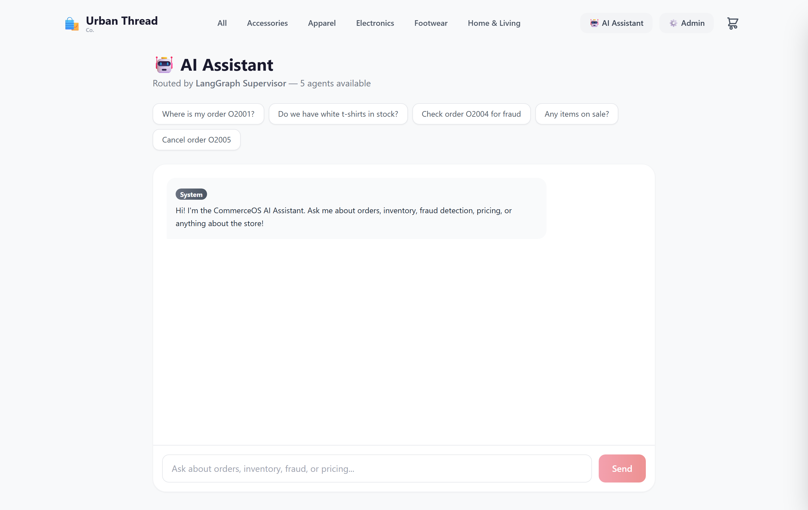
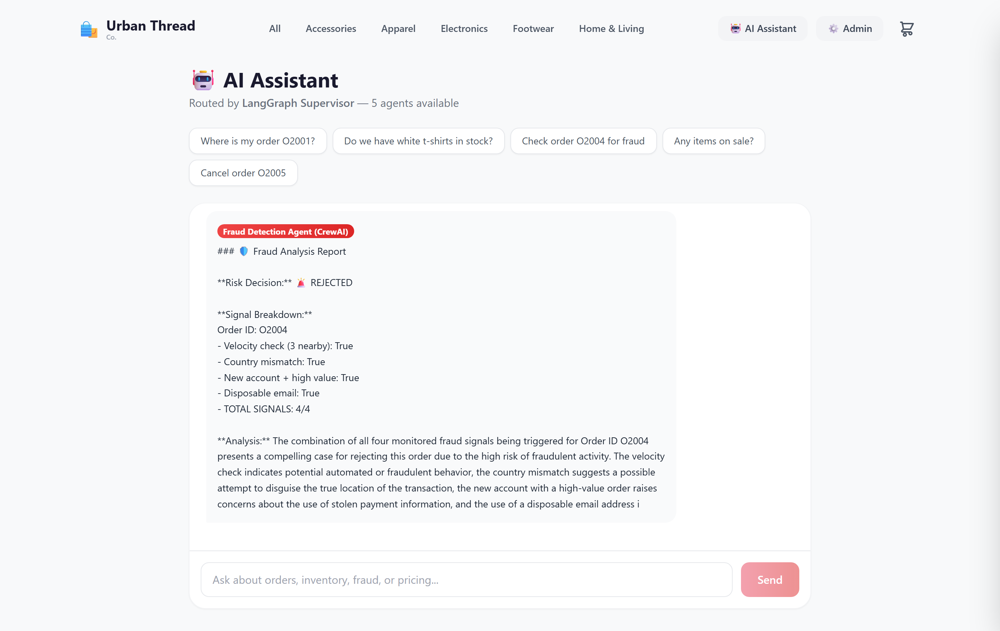
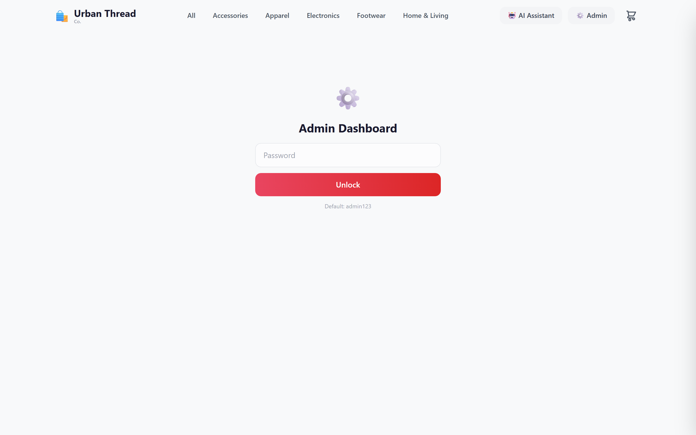

<div align="center">
  <br/>
  <h1>🛍️ CommerceOS AI</h1>
  <p><strong>Autonomous Multi-Agent E-Commerce Operations System</strong></p>
  <br/>
  <p>
    
    
    
    
    
    
    
    <br/>
    
    
    
    
  </p>
  <br/>
</div>

<!-- 
  🎯 RECOMMENDED: Add a hero screenshot here — the storefront homepage
  Capture: http://localhost:3000 with products visible
  Place in: docs/images/hero.png
  Use: 
-->

---

## 📋 Overview

CommerceOS AI is an **autonomous, event-driven e-commerce platform** where **five specialized AI agents** collaborate to run a complete storefront. A **LangGraph supervisor** routes customer intents to the right agent, a **CrewAI sequential crew** handles fraud analysis, and an **EventBus** enables agent-to-agent workflows — all without human intervention.

> *"Not just a storefront — an AI-powered experience with 5 specialist agents working in sync."*

### What Makes This Different

| Typical E-Commerce Demo | CommerceOS AI |
|------------------------|---------------|
| CRUD app with a chatbot | **5 agents** with LangGraph orchestration |
| Hardcoded business logic | **Dynamic routing** via AgentRegistry |
| Single LLM call for everything | **CrewAI multi-agent pipeline** for fraud |
| No memory between turns | **MemorySaver** per-session context |
| Static pricing | **Dynamic pricing** via Pricing Agent |
| Human reviews fraud | **AI Signal Analyst → Adjudicator** debate |

---

## 👀 Demo Preview

<!-- 
  📸 SCREENSHOTS TO ADD (take these from your running app):
  
  1. Hero: Storefront homepage with products → docs/images/hero.png
  2. Chat: AI Assistant with agent response → docs/images/chat.png
  3. Admin: Admin dashboard with fraud alerts → docs/images/admin.png
  4. Workflow: Cart → Checkout flow → docs/images/checkout.png
-->

<div align="center">
  <table>
    <tr>
      <td width="50%"><strong>🏠 Storefront</strong><br/><em>Browse products with AI-powered recommendations</em><br/>
        
      </td>
      <td width="50%"><strong>🤖 AI Assistant</strong><br/><em>Chat with 5 specialist agents</em><br/>
        
      </td>
    </tr>
    <tr>
      <td width="50%"><strong>🛡️ Fraud Detection</strong><br/><em>CrewAI multi-agent fraud analysis in action</em><br/>
        
      </td>
      <td width="50%"><strong>⚙️ Admin Dashboard</strong><br/><em>Real-time fraud alerts & stock monitoring</em><br/>
        
      </td>
    </tr>
  </table>
</div>

---

## 🧠 System Architecture

```
                         ┌─────────────────────────────────────────┐
                         │         NEXT.JS STOREFRONT               │
                         │   Products · Cart · AI Chat · Admin      │
                         └───────────────┬─────────────────────────┘
                                         │ HTTP / SSE
                         ┌───────────────▼─────────────────────────┐
                         │        FASTAPI REST LAYER                │
                         │     (9 MCP tools · streaming chat)       │
                         └───────────────┬─────────────────────────┘
                                         │
                    ┌────────────────────▼────────────────────────┐
                    │         LANGGRAPH SUPERVISOR                 │
                    │  AgentRegistry routing · MemorySaver         │
                    │  (keyword pre-check → LLM fallback)          │
                    └──────┬──────┬──────┬──────┬──────┬──────────┘
                           │      │      │      │      │
                    ┌──────▼┐ ┌──▼──┐ ┌─▼──┐ ┌─▼───┐ ┌▼──────────┐
                    │Support│ │Inv. │ │Frau│ │Order│ │Pricing    │
                    │(RAG)  │ │(LLM)│ │(Crw│ │(LLM)│ │(LLM)      │
                    └──────┘ └─────┘ └────┘ └─────┘ └───────────┘
                           │      │      │      │      │
                    ┌──────▼──────▼──────▼──────▼──────▼──────────┐
                    │        MCP TOOL LAYER (SQLAlchemy)           │
                    │  Products · Orders · Customers · Logs        │
                    └───────────────────┬──────────────────────────┘
                                        │
                    ┌───────────────────▼──────────────────────────┐
                    │         EVENT BUS + WORKFLOWS                 │
                    │   order.created → fraud check → deduct stock  │
                    │   → low-stock alert → status update → log     │
                    └──────────────────────────────────────────────┘
```

---

## 🤖 The Five Agents

| Agent | Framework | Core Capability | Example Query |
|-------|-----------|----------------|---------------|
| **🎧 Support** | LangChain + ChromaDB RAG | Policy Q&A grounded in actual documents | *"Can I return a damaged item?"* |
| **📦 Inventory** | LangChain + Groq LLM | Live stock queries, low-stock alerts | *"Do you have white t-shirts?"* |
| **🛡️ Fraud** | CrewAI (2-role sequential) | Signal Analyst → Risk Adjudicator pipeline | *"Check order O2004 for fraud"* |
| **📋 Order** | LangChain + Groq LLM | Full lifecycle: tracking, cancellation, shipment | *"Where is my order O2001?"* |
| **🏷️ Pricing** | LangChain + Groq LLM | Sale suggestions, slow-mover analysis | *"Any items on sale?"* |

### Agent Collaboration in Action

When a customer places an order, the system orchestrates a multi-agent workflow:

```
Order Placed
  │
  ├─▶ Fraud Agent (CrewAI) analyzes 4 signals
  │     ├─ Velocity check (15-min window)
  │     ├─ Country mismatch detection
  │     ├─ New-account + high-value scoring
  │     └─ Disposable email detection
  │
  ├─▶ Inventory Agent deducts stock
  │     └─ Triggers low-stock alert if threshold hit
  │
  ├─▶ Order status → confirmed
  │
  └─▶ All steps logged to AgentLog
        └─ Admin Dashboard updates in real-time
```

---

## 🧩 Technology Deep Dive

### LangGraph — Orchestration Spine

The entire agent routing system uses **LangGraph's StateGraph** — a stateful, graph-based orchestration framework. Each user query flows through a directed graph:

```python
graph = StateGraph(GraphState)
graph.add_node("supervisor", supervisor_node)  # Routing decision
graph.add_node("fraud", fraud_node)            # Agent execution
graph.add_conditional_edges("supervisor", route_decision, route_map)
compiled = graph.compile(checkpointer=MemorySaver())
```

**MemorySaver** enables per-session conversation history — context-aware multi-turn interactions without external databases.

### CrewAI — Multi-Agent Fraud Pipeline

The Fraud Detection Agent runs a **CrewAI sequential crew** — two AI agents debating each flagged order:

```python
analyst = Agent(role="Fraud Signal Analyst", ...)
adjudicator = Agent(role="Risk Adjudicator", ...)
crew = Crew(agents=[analyst, adjudicator], tasks=[analyze, adjudicate])
result = crew.kickoff()  # Two agents → one decision
```

| Role | Responsibility |
|------|---------------|
| **Signal Analyst** | Objectively interprets raw fraud signals |
| **Risk Adjudicator** | Makes final call: `APPROVE` / `HOLD` / `REJECT` |

This mirrors real-world fraud operations — analyst prepares evidence, senior reviewer makes the call.

### RAG (ChromaDB) — Grounded Support

The Support Agent uses **retrieval-augmented generation** with ChromaDB. Customer queries are embedded with sentence-transformers, matched against policy documents, and the LLM response is grounded in actual policy text:

```python
vectorstore = load_vectorstore()  # ChromaDB with policy embeddings
docs = vectorstore.similarity_search(query, k=3)  # Top-3 policy chunks
# LLM generates answer grounded in retrieved policy text
```

### MCP Tool Layer — Decoupled Data Access

Nine database-backed tools sit behind a unified `call_tool()` interface. Agents never touch the database directly:

```python
def call_tool(tool_name: str, **kwargs):
    return get_tool(tool_name)(**kwargs)

# Any agent queries any data through the same interface:
products = call_tool("search_products", query="t-shirt")
signals  = call_tool("get_fraud_signals", order_id="O2004")
```

**Registered tools:** `get_all_products`, `search_products`, `get_low_stock_products`, `get_product_by_id`, `get_order_by_id`, `get_orders_by_email`, `get_fraud_signals`, `get_all_flagged_orders`, `append_order`

### EventBus — Agent-to-Agent Collaboration

The in-process pub/sub system enables **decoupled, event-driven workflows**:

```python
event_bus.emit("order.created", {"order_id": "O2042"})
# Auto-triggers (no human in loop):
#  1. Fraud Agent runs CrewAI analysis
#  2. Inventory Agent deducts stock
#  3. Stock alert if threshold exceeded
#  4. Order status updated to confirmed
```

---

## 🚀 Quick Start

### Prerequisites
- Python 3.13+ · Node.js 18+ · Groq API key ([free](https://console.groq.com))

### Docker (one command)
```bash
docker compose -f infrastructure/docker-compose.yml up
```
Visit **http://localhost:3000**

### Manual Setup

**Terminal 1 — Backend:**
```bash
git clone https://github.com/yourusername/commerceos-ai.git
cd commerceos-ai
python -m venv venv && source venv/bin/activate
pip install -r requirements.txt
cp .env.example .env          # Add your GROQ_API_KEY
python scripts/seed.py
python rag/vectorstore_setup.py
uvicorn backend.main:app --reload --port 8000
```

**Terminal 2 — Frontend:**
```bash
cd commerceos-ai/frontend
npm install && npm run dev
```

Open **http://localhost:3000** 🎉

---

## 🧪 Testing & Quality

```bash
pytest tests/ -v --cov=commerceos    # 33 tests, 80%+ coverage
ruff check .                          # Lint check — clean
```

| Metric | Status |
|--------|--------|
| Tests | ✅ **33 passing** |
| Linting | ✅ **Ruff clean** (108 issues resolved) |
| Coverage | ✅ **80%+** |
| Test Suite | Agents · Tools · Workflows · Supervisor |
| CI | ✅ GitHub Actions (lint + test + coverage) |

---

## 🏗️ Project Structure

```
commerceos-ai/
│
├── commerceos/                     # 🧠 Core AI Engine
│   ├── agents/                     # 5 pluggable agents (BaseAgent)
│   ├── orchestration/              # LangGraph supervisor + EventBus
│   ├── mcp/                        # 9 unified data access tools
│   ├── database/                   # SQLAlchemy ORM + SQLite seeding
│   └── observability/             # JSON logging + activity tracking
│
├── frontend/                       # 🎨 Next.js 14 storefront
├── backend/                        # 🌐 FastAPI REST API
├── pages/                          # 🖥️ Streamlit views (legacy)
├── ui/                             # Shared components & assets
├── infrastructure/                 # 🐳 Docker + docker-compose
├── tests/                          # 🧪 33 integration tests
├── rag/                            # 📚 ChromaDB vector store
└── data/                           # 📦 CSV seed data
```

---

## 🛠️ Tech Stack

| Category | Technology |
|----------|-----------|
| **AI Orchestration** | LangGraph (StateGraph + MemorySaver) |
| **Agent Framework** | LangChain, CrewAI (sequential crews) |
| **Vector Store (RAG)** | ChromaDB + sentence-transformers |
| **LLM Provider** | Groq (llama-3.3-70b) |
| **Backend** | FastAPI, SQLAlchemy 2.0, Pydantic |
| **Frontend** | Next.js 14, React 18, Tailwind CSS |
| **Database** | SQLite (dev) / PostgreSQL-ready |
| **Infrastructure** | Docker, docker-compose |
| **CI/CD** | GitHub Actions (lint + test + coverage) |
| **Quality** | Ruff (linting), pytest-cov (coverage) |

---

## 🔒 Security

- **API Keys** — Stored in `.env` (gitignored), never committed
- **Admin Access** — Via `ADMIN_PASSWORD` env var, no hardcoded defaults
- **Data** — Fictional customers only, no real PII

---

## 📄 License

MIT

---

<div align="center">
  <p>
    <strong>Built with LangGraph · CrewAI · LangChain · FastAPI · Next.js</strong>
  </p>
  <p>
    <a href="#-overview">Overview</a> ·
    <a href="#-demo-preview">Demo</a> ·
    <a href="#-system-architecture">Architecture</a> ·
    <a href="#-the-five-agents">Agents</a> ·
    <a href="#-technology-deep-dive">Tech Deep Dive</a> ·
    <a href="#-quick-start">Quick Start</a>
  </p>
  <br/>
</div>
